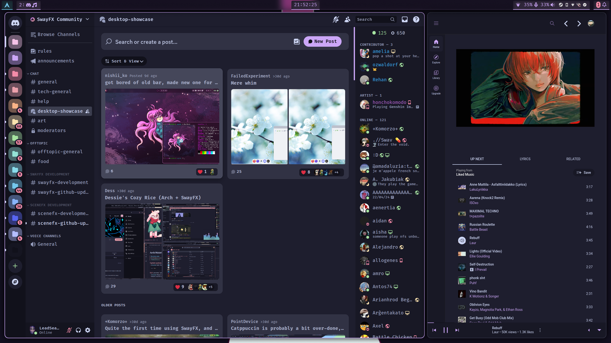
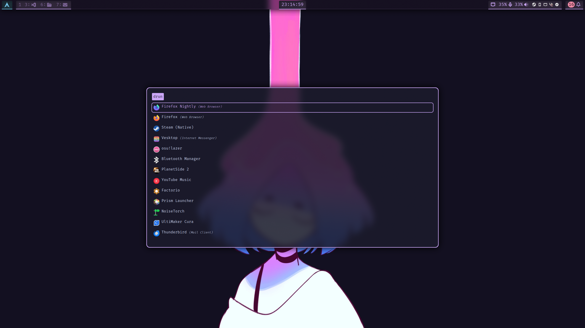
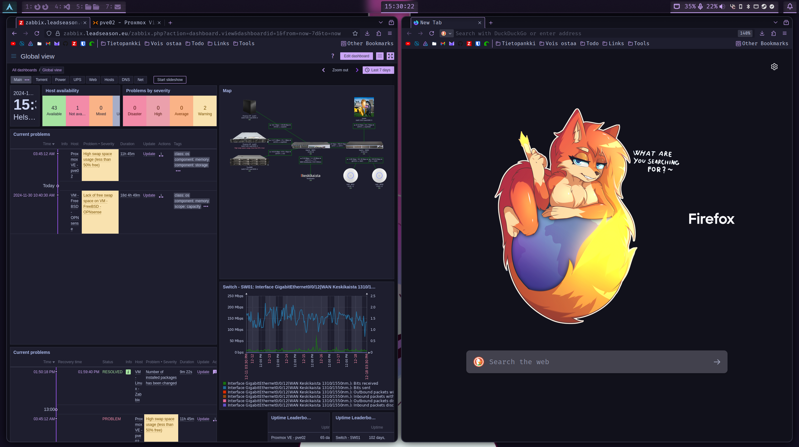

<h1 align="center">LeadSeason's Dotfiles</h1>
<p align="center">Collection of dotfiles. Used to sync between two computers.</p>

## About
**Warning**: Don’t blindly use my settings unless you know what that entails.
Use at your own risk!  
These dotfiles should be used as a example.

## ScreenShots
<p align="center">
  <p>SwayFX WM | Astal Bar | Kitty terminal
    
  </p>
  <p>Vencord | YouTube Music
    
  </p>
  <p>App launcher Rofi
    
  </p>
  <p>Zabbix | Firefox Nightly
  
  </p>
</p>

## Programs used / Libraries / Etc
### SwayFX - Wayland compositor
Sway but with Eyecandy. [WillPower3309/swayfx](https://github.com/WillPower3309/swayfx)

### Catppuccin Theme
A nice looking pallet with multiple premade configurations.

### Astal - Bar
Custom bar made with [Astal](https://github.com/aylur/astal) written in typescript, ran with [AGS](https://github.com/Aylur/ags)

#### Sway Workspace widget
Used [i3ipc-gjs](https://github.com/acrisci/i3ipc-gjs/) for the workspace. This is required if you want to run my configuration.

#### Sworkstyle
[Sworkstyle or swayest_workstyle](https://github.com/Lyr-7D1h/swayest_workstyle/) for the workspace icon. Renames the workspaces depending on whats on them 

### SwayNC - Notification deamon
[ErikReider/SwayNotificationCenter](https://github.com/ErikReider/SwayNotificationCenter)

### Kitty - Terminal
Kitty terminal, Quite a good terminal emulator.

### Vencord - Discord Client
Vencord includes a bunch of included plugins as well css support. Also using [vesktop](https://github.com/Vencord/Vesktop) for improved linux support. 

### Youtube music
[th-ch Youtube](https://github.com/th-ch/youtube-music) desktop application used with custom css. 

### Rofi lbonn
[Rofi lbonn](https://github.com/lbonn/rofi) is a fork of rofi with wayland support

#### Rofi-emoji
[Rofi-Emoji](https://github.com/Mange/rofi-emoji) For my Emogie needs

### Stow
Stow is a program to create hyperlinks. All my dotfiles and repository lives in ~/.dotfiles  
Stow creates hyperlinks for all the files is my dotfiles folder to my home folder  
For example sway. Sway configuration file is in ~/.dotfiles/.config/sway/ but stow creates a hyperlink to it.
```
$ ls -l ~/.config/sway
/home/leadseason/.config/sway -> ../.dotfiles/.config/sway
``` 

### Zabbix
[Zabbix](https://www.zabbix.com/) is an enterprise monitoring solution, I use it for my homelab monitoring.  
Catppuccin theme is made by me, [LeadSeason/zabbix-catppuccin](https://github.com/LeadSeason/zabbix-catppuccin/)

### Firefox Customization
Firefox customization is done through userChrome. Includes my furry configuration + https://github.com/black7375/Firefox-UI-Fix
